# PhyloView documentation

## 1 Introduction

### 1.1 What is PhyloView

[PhyloView](http://www.phyloview.cc) is a [d3.js](https://d3js.org)based tool for visualizing Phylogenetic trees. PhyloView supports tree files in Newick and Nexus formats and exports images in SVG, PNG formats. PhyloView also supports selecting branches, marking branches, editing or deleting subtrees, converting tree structures, changing fonts, displaying metadata, etc.

### 1.2 Quick Use

#### 1.2.1 Import PhyloView

Create an .html file and import PhyloView as follows. The latest version supports `CommonJS` and can be imported with one line of code. It is recommended to import PhyloView using an exact version link to avoid breaking newer versions.

```html
<!-- The first way: importing PhyloView online-->
<script src="http://www.darwintree.cn/PhyloView/phyloview.main.js"></script>

<!-- The second way: importing PhyloView locally-->
<script src="./phyloview.main.js"></script>
```

A complete example is shown below:

```html
<!DOCTYPE html>
<html lang="en">
<head>
    <meta charset="UTF-8">
    <meta http-equiv="X-UA-Compatible" content="IE=edge">
    <meta name="viewport" content="width=device-width, initial-scale=1.0">
    <title>Rectangular</title>
</head>
<body>
<div id="dendrogram"></div>
<script src="http://www.darwintree.cn/PhyloView/phyloview.main.js"></script>
<script>
    new phyloview.InitTreeStructure("#dendrogram", {
	    "content": "(A:0.1,(B:0.3,C:0.4)D:0.5)E;"
    })
</script>
</body>
</html>
```

This file is named index.html, the figure shows a tree when the file is opened with a browser.

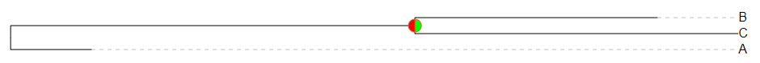

<center>Figure 1.1: index.html shows a simple tree</center>

#### 1.2.2 Modules

`PhyloView` is based on `ES2015 modules (opens new window)`. Developers can use `Rollup`, `webpack` or other packaging tools to build projects. The following code shows how to import all or part of PhyloView into an application that is compatible with `ES2015`.

```javascript
import { InitTreeStructure } from "phyloview.js";
```

#### 1.2.3 Environment

PhyloView supports the latest browsers including Chrome, Edge, Firefox and Safari.

## 2 Import/Export

### 2.1 Overview

PhyloView supports a variety of tree formats and file formats. To import a tree, PhyloView supports formats such as Newick, Nexus, PhyloXML and NeXML. For exporting a tree, PhyloView supports file formats such as SVG and PNG, as well as tree formats such as Newick, Nexus, PhyloXML and NeXML.

### 2.2 Import

#### Newick

The Newick format is a common tree format. The following Newick text represents the tree shown in Figure 2.1.

```json
(A:0.1,B:0.2,(C:0.3,D:0.4)E:0.5)F;
```

As the text shows, brackets represent internal nodes. For example, `(C:0.3,D:0.4)E:0.5` means that node C and node D converge on node D along the path, and the number after the colon represents the length of the branch.


<center>Figure 2.1：a simple tree</center>

#### Nexus

Nexus is a popular tree format which is supported by many phylogenetic tools. Nexus files generally have `.nxs` and `.nex` extensions. The following Nexus file can be used to represent the tree shown in Figure 2.1.

```
#NEXUS
BEGIN TAXA;
      Dimensions NTax=6;
      TaxLabels A B C D E F;
END;
BEGIN TREES;
      Tree best=(A:0.1,B:0.2,(C:0.3,D:0.4)E:0.5)F;
END;
```

In Nexus files, the first line must start with `#NEXUS`. Nexus uses blocks to store data. As the Nexus file shows, in **TAXA block**, **DATA block**, **TREES block**, each block starts with `BEGIN`, and ends with `END`. A TAXA block is required in these blocks. You can get more information through [Nexus documentation](http://wiki.christophchamp.com/index.php?title=NEXUS_file_format).

#### PhyloXML

PhyloXML is an XML language used for describing phylogenetic trees and related data. The following PhyloXML text can be used to represent the tree in Figure 2.1

```xml
<?xml version="1.0" encoding="UTF-8"?>
<phyloxml xmlns="http://www.phyloxml.org" xmlns:xsi="http://www.w3.org/2001/XMLSchema-instance" xsi:schemaLocation="http://www.phyloxml.org http://www.phyloxml.org/1.00/phyloxml.xsd">
<phylogeny rooted="true">
   <clade>
	  <name>F</name>
      <clade branch_length = "0.1">
           <name>A</name>
      </clade>
	  <clade branch_length = "0.2">
           <name>B</name>
      </clade>
      <clade branch_length = "0.5">
         <name>E</name>
         <clade branch_length = "0.3">
               <name>C</name>
         </clade>
         <clade branch_length = "0.4">
               <name>D</name>
         </clade>
      </clade>
   </clade>
</phylogeny>
</phyloxml>
```

It's easy to see that if you just want to describe a simple tree, using PhyloXML makes the process more complex and less applicable.[Click to check more information about PhyloXML](https://bmcbioinformatics.biomedcentral.com/articles/10.1186/1471-2105-10-356)。

#### NeXML

NeXML is an XML based format. The following NeXML file can be used to represent the tree shown in Figure 2.1.

```xml
<nex:nexml xmlns:dc="http://purl.org/dc/elements/1.1/" xmlns:xsd="http://www.w3.org/2001/XMLSchema#" xmlns:map="http://phylomap.org/terms.owl#" xmlns="https://nexml.github.io/2009" xmlns:nex="https://nexml.github.io/2009" xmlns:xsi="http://www.w3.org/2001/XMLSchema-instance" xmlns:rdf="http://www.w3.org/1999/02/22-rdf-syntax-ns#" generator="Bio::Phylo::Project v.0.58" version="0.9" xsi:schemaLocation="https://nexml.github.io/2009 https://nexml.github.io/2009/nexml.xsd">
<otus id="os10">
	<otu id="ou11" label="A"/>
	<otu label="B" id="ou12"/>
	<otu label="C" id="ou13"/>
	<otu label="D" id="ou14"/>
</otus>
<trees otus="os10" id="ts2">
	<tree id="te3" xsi:type="nex:FloatTree">
		<node id="ne4" root="true" label="F"/>
		<node id="ne5" otu="ou11" label="A"/>
		<node otu="ou12" label="B" id="ne6"/>
		<node id="ne7" label="E"/>
		<node id="ne8" otu="ou13" label="C"/>
		<node id="ne9" label="D" otu="ou14"/>
		<edge source="ne4" id="edge5" target="ne5" length="0.1"/>
		<edge id="edge6" target="ne6" length="0.2" source="ne4"/>
		<edge id="edge7" target="ne7" length="0.5" source="ne4"/>
		<edge source="ne7" target="ne8" id="edge8" length="0.3"/>
		<edge source="ne7" length="0.4" target="ne9" id="edge9"/>
	</tree>
</trees>
</nex:nexml>
```

The [NeXML official website](https://nexml.github.io/) provides features such as `Nexus->NeXML`, `Newick->NeXML`, `NeXML->json`, `NeXML->rdf`.To get more information about NeXML, you can [click here](https://github.com/nexml/nexml/wiki/NeXML-Manual).

### 2.3 Export

#### SVG

SVG is a vector graphics format that uses XML, and its image quality is not affected by zooming. In addition, the file size of SVG is smaller than that of PNG, JPEG, etc. And it is much more suitable for network transmission.

#### PNG

PNG is a bitmap format that adopts lossless compression algorithm, so it can be used to compress image and support transparent effect on the premise of ensuring image quality.

Besides, PhyloView supports exporting trees to Newick, Nexus, PhyloXML and NeXML formats.

## 3 Display

### 3.1 Overview

Trees can be visualized through `phyloview.InitTreeStructure()`, another parameter in `InitTreeStructure` is of type `object`, including many subparameters which can be used to show or hide nodes, adjust legend or style of branches.

### 3.2 Basic settings

The basic settings support hiding/showing the basic contents of the phylogenetic tree, including node names, support values, graphics, branch length, leaf area mask, legend, scroll wheel on/off, and so on.

#### 3.2.1 Node name/Support value

With display enabled, the result is shown in Figure 3.1.


<center>Figure 3.1: displaying node names</center>

#### 3.2.2 Branch length

Branch length is displayed if enabled.


<center>Figure 3.2: branch length</center>

#### 3.2.3 Sorting

PhyloView supports 6 sorting methods, they are default ascending, default descending, length ascending, length descending, name ascending, name descending.


<center>Figure 3.3: length ascending/descending</center>


<center>Figure 3.4: name ascending/descending</center>

#### 3.2.4 Scaling

PhyloView supports scaling operations.


<center>Figure 3.5: comparison of X-axis scaling</center>


<center>Figure 3.6 comparison of Y-axis scaling</center>

#### 3.2.5 Mask

When masking is on, the right leaf area of the tree displays an opaque mask.

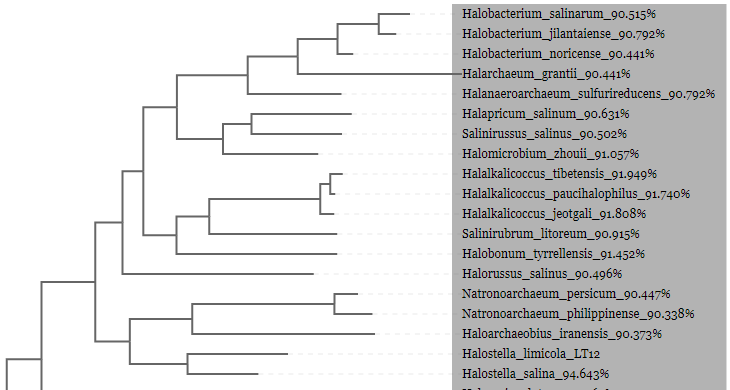

<center>Figure 3.7: Mask</center>

### 3.3 Styles

PhyloView supports legend and allows users to edit branch, leaf and node styles.

#### 3.3.1 Legend

The legend feature supports regional segmentation and color matching of the area, as shown in Figure 3.8.


<center>Figure 3.8: legend feature (left is enabled while right is disabled)</center>

#### 3.3.2 Branch style

PhyloView supports adjusting the thickness and color of branches, but if the **legend** feature is enabled at the same time, the color adjustment via **branch style** will not work.


<center>Figure 3.9: phylogenetic tree with different styles</center>

It is also possible to adjust the dashed line, as shown in figure 3.10.


<center>Figure 3.10: dashed lines</center>

#### 3.3.3 Branch type

Three branch types are supported in PhyloView: elbow, smooth and straight. They are shown in Figure 3.10


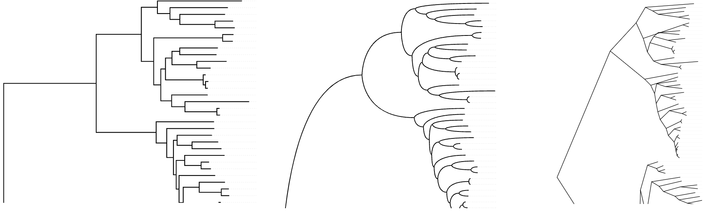

<center>Figure 3.11: elbow, smooth and straight</center>

#### 3.3.4 Leaf style

PhyloView supports the customization of font, font color and font size on the leaf node labels. Note that if the **legend** feature is enabled, the color customization feature of leaf nodes will be overwritten, resulting in ineffective color changes.


<center>Figure 3.12: phylogenetic trees with different branch and leaf styles</center>

#### 3.3.5 Node style

The node supports the display of pie charts and filled circles, as shown in Figure 3.13~3.15.


<center>Figure 3.13: pie chart</center>


<center>Figure 3.14: filled circle</center>


<center>Figure 3.15: empty circle</center>

### 3.4 Metadata

Metadata includes tooltips and signs.

#### 3.4.1 Tooltips

Move the mouse over the leaf node name and tooltips will appear, as shown in Figure 3.12.


<center>Figure 3.16: tooltips</center>

#### 3.4.2 Signs

Bars, pies and other sign are also supported.

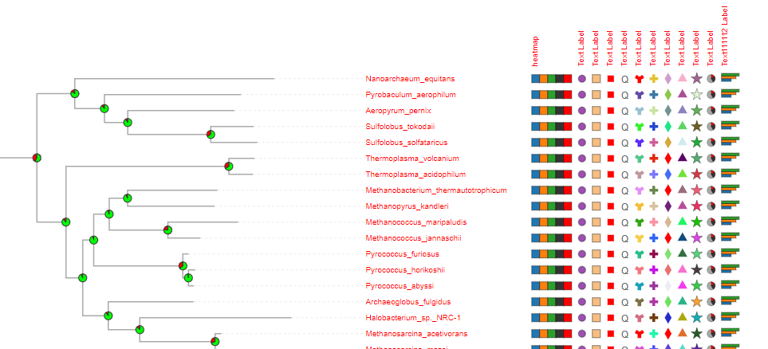

<center>Figure 3.17: signs</center>

### 3.5 Branch optimization

Support for displaying branch lengths using different scales, i.e. using different scales for different branches of the same tree so that the differences between branches can be seen more clearly.

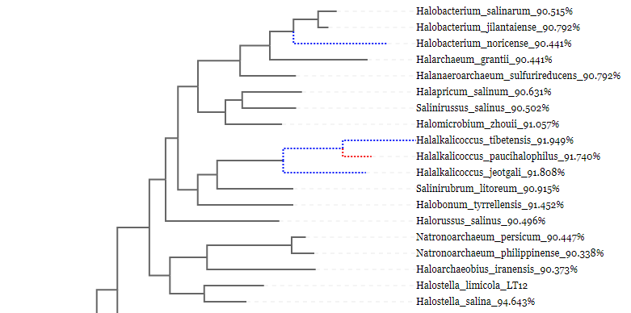

<center>Figure 3.18: Multi scale display of branch length（<font color="blue">blue</font> is expanded to 10 times the original length, <font color="red">red</font> is expanded to 10 times the original length）</center>

## 4 Operations

### 4.1 Overview

PhyloView supports visual operations, such as selecting nodes or branches, transforming tree structures, dragging graphic area, etc.

### 4.2 Scaling and dragging

Scaling and dragging are supported in PhyloView.


<center>Figure 4.1: Scaling and dragging</center>

### 4.3 Tree topology

Support the display of phylogenetic tree in rectangular and circular view.


<center>Figure 4.2: rectangular</center>


<center>Figure 4.3: circular</center>

### 4.4 Shortcuts

Support marking subtree branches, editing subtrees, flipping subtrees, resetting trees, exporting selected branches, and downloading Newick structures.


<center>Figure 4.4: right click a node shows a menu</center>

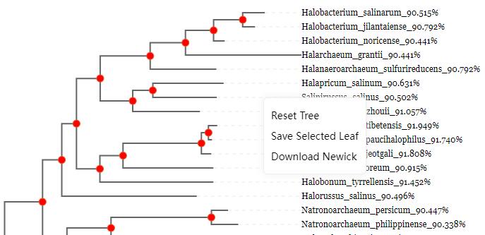

<center>Figure 4.5: right click a white area show a different menu</center>

## 5 Configuration

The configuration file is shown in Figure 5.1. The usage is as follows:


<center>Figure 5.1: content is the config object</center>

### content

`string`

PhyloView supports Newick, Nexus, PhyloXML and NeXML tree formats. The following code shows a tree in Figure 2.1.

```json
content: "(A:0.1,B:0.2,(C:0.3,D:0.4)E:0.5)F";
```

### width

`number`

Set the canvas width to 1600 by default. If the value is too small, the tree will not be fully displayed.

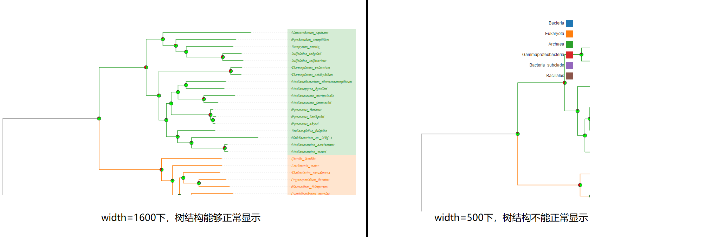

<center>Figure 5.2: width comparison</center>

### height

`number`

Set the height of the canvas. If the value is too small, the tree structure will not be fully displayed.

### sort

`string`

Set the sorting method for the tree structure. There are six optional sorting methods: defaultAsc, defaultDes, nameDes, nameAsc, lengthDes, lengthAsc. While defaultAsc and defaultDes sort according to the level of the node. The result of the following code is shown in Figure 5.4.

```json
sort = "nameDes"
```


<center>Figure 5.3: nodes are arranged in descending name order</center>

### size

`array`

No more than 2 values, where size[0] controls the horizontal stretching of the canvas, size[1] controls the width of the canvas, and size[1] is optional, as shown below:

```json
# Horizontal stretch value 800, canvas width 400
size = [800, 400]
# The horizontal stretch value is 400, and the canvas width equals with width
size = [400]
```


<center>Figure 5.4: lateral stretch comparison</center>

### position

`array`

Control the left margin and top margin, as shown in Figure 5.5:

```json
// The left margin is 20 and the top margin is 100
position=[20, 100]
```


<center>Figure 5.5：position comparison</center>

### separation

`number`
Adjust the longitudinal stretch value in the range [0,20]. The higher the value, the longer the longitudinal display of the phylogenetic tree.

```json
// The longitudinal stretch value is set to 10
position = 10
```


<center>Figure 5.6: longitudinal comparison</center>

### scale

`number`

The larger the overall stretch ratio, the greater the width and height of the phylogenetic tree.

```json
// The longitudinal stretch value is set to 10
scale = 1.2
```

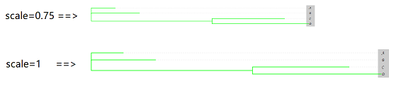

<center>Figure 5.7: scale comparison</center>

### stretch

 `object`

stretch.show： `boolean` , enable stretch if enabled.

stretch.data： `boolean` , range and scales.

Here is an example:

```json
// branches which length in [0.001,0.003),[0.003,0.005) and [0.005,0.008) will be expanded by 1, 2, 3 times respectively.
stretch: {
    "show": true,
    "data": [
        {
            "range": [
                0.001,
                0.003
            ],
            "multiple": 1,
            "color": "red"
        },
        {
            "range": [
                0.003,
                0.005
            ],
            "multiple": 2,
            "color": "blue"
        },
        {
            "range": [
                0.005,
                0.008
            ],
            "multiple": 3,
            "color": "green"
        }
    ]
}
```


<center>Figure 5.8: branch optimization</center>

### isCollapsible

`boolean`

Whether or not to allow the subtree to collapse. If enabled, users can click on any inner node to collapse the subtree, as shown in Figures 5.9 and 5.10.

```json
// Collapse feature is enabled
isCollapsible = true
```


<center>Figure 5.9: click node to collapse the subtree</center>


<center>Figure 5.10: folding</center>

To unfold subtree, users can click the triangle symbol.

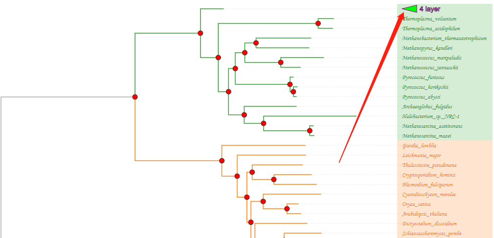

<center>Figure 5.11: unfold subtree</center>

### isPhylogram

`boolean`

If true, all leaf branches will be right-aligned, otherwise the branches will be displayed with their real branch length. As shown in Figure 5.12 and Figure 5.13

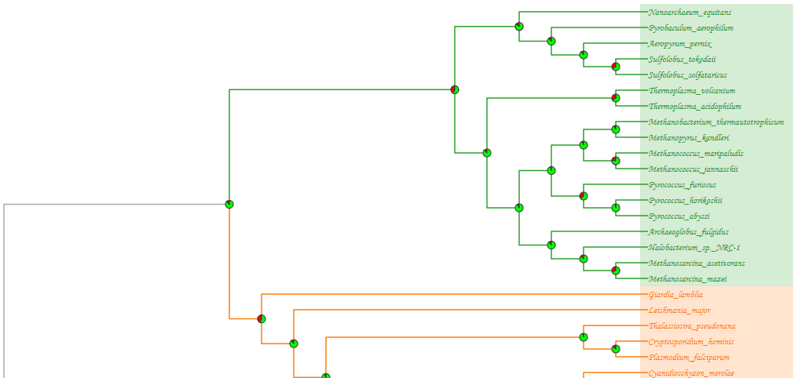

<center>Figure 5.12：isPhylogram=true, align all leaf branches to the right</center>


<center>Figure 5.13：isPhylogram=false, showing branches with branch length</center>

### isWheelZoom

`boolean`

If true, wheel scaling and phylogenetic tree dragging feature will be enabled 


<center>Figure 5.14: slide the scroll wheel to zoom phylogenetic tree, and click to drag the screen</center>

### style

`object`

The global text style of the canvas, which can be overwritten with other styles.

style["font-family"]：`string` type, which is used to set the font-family, can be null, and it can be set to the following optional values`["Aria"、"Georgia"、"Verdana"、"Courier"、"Courier New"、"Times New Roman"、"Impact、Monotype Corsiva"]`，

style.fill：`string` type, is used to set color of the filled shape

style["font-size"]：`string` type, is used to set the font size

The result of following code is shown in Figure 5.15.

```json
// Set the font set to Monotype Corsiva and fill it with red color. The font size is 10px
style = {
	'font-family': "Arial",
	'fill': 'red',
    'font-size': "10px",
}
```


<center>Figure 5.15: global font style</center>

### leafs

`object`

It is used to control the display of leafs area. The subparameters are shown as follows:

leafs.show：`boolean` type, leaves area will show if true value is set

leafs.dx： `number` type, horizontal offset of leaves area

leafs.dy：`number` type, vertical offset of leaves area

leafs.style：`object` type, text style of the leaves area

leafs.formatter：`function` type, which is a callback function, the parameter selection is an instance returned by d3.select, while data is another parameter containing data with each individual leaf node.

Result of the following code is shown in Figure 5.16.

```json
leafs = {
	show: true,
	dx: 0,
	dy: 0,
	style: {
        // Font is filled with blue
		fill: 'blue',
		// Note that this should be of type number and cannot be written as "12px", which is different from the style in other places
		'font-size': 12,
		'font-family': "Monotype Corsiva"
	},
    // Callback function
	formatter: function (select, data) {
        // If the branch length is greater than 0.5, then set the label size to 20px and set color to red
        if (data.data.length > 0.5) {
        	select.attr("font-size", "20px")
        	select.attr("fill", "red")
        }
	}
}
```


<center>Figure 5.16: leaf node style</center>

### extension

`object`

Controls properties of dashed lines.

```json
extension = {
    // The default value is true. If set false, the phylogenetic tree will be hidden
	show: true,
    // Dashed line style
	style: {
		stroke: '#aaa',
		'stroke-dasharray': 3,
		'stroke-width': 1,
	}
}
```

### mask

`object`

It is used to control the leaf node mask. The subparameters are shown as follows.

mask.show：`boolean` type, show mask on leaves

mask.dx： `number` type, horizontal offset of the mask

mask.dy：`number` type, vertical offset of the mask

mask.padding：`array` type, paddings of the mask

mask.style：`object` type, style of the mask

```json
mask = {
	show: true,
	dx: 0,
	dy: 0,
	padding: [10, 10],
	style: {
		opacity: 0.2
	}
}
```


<center>Figure 5.17: leaf node mask styles</center>

### nodes

`object`

Properties of the nodes, sub properties are shown as follows:

nodes.value：`object`,  style of bootstrap values

nodes.collapse：`object`, style of triangular symbols

nodes.name：`object`, style of node names

nodes.shape：`object`, style of node shapes

```json
// This code relates to figure 5.18
nodes.value = {
	show: false,
    // Horizontal offset
	dx: -10,
    // Vertical offset
    dy: -5,
    style: {
    	"text-anchor": 'end',
        fill: '#000',
        'font-size': 10,
        'font-family': "sans-serif",
    },
    // Callback function
    formatter: function (select, data) {}
}
```


<center>Figure 5.18: bootstrap value</center>

```json
// This code relates to figure 5.19
nodes.collapse = {
    // Horizontal offset of the triangular symbol
	dx: 0,
    // Vertical offset of the triangular symbol
    dy: 0,
    // Rotation angle of the triangular symbol, if greater than 0 then shows clockwise rotation angle, else less than 0 then shows counterclockwise rotation angle
    rotate: 0,
    // Width and height of triangular symbol
    size: [30, 15],
    style: {
    	fill: 'lime',
        stroke: 'purple',
        'stroke-width': 1,
        cursor: 'pointer'
    },
    // Callback function
    formatter: function (select, data) {}
}
```


<center>Figure 5.19: triangular fold symbol to the right</center>

```json
// This code relates to figure 5.20
nodes.name = {
    show: false,
    dx: 10,
    dy: 3,
    style: {
       "text-anchor": 'start',
       fill: '#000',
       'font-size': 10,
       'font-family': "sans-serif"
    },
    formatter: function (select, data) {}
}
```


<center>Figure 5.20: node names</center>

```json
// This code relates to figure 5.21~5.23
nodes.shape = {
    // Two optional value are supported: pie, circle
    type: 'pie',
    dx: 0,
	dy: 0,
    style: {
		"stroke-width": 1,
        fill: 'rgb(255, 120, 57)',
        stroke: "#333",
        cursor: 'pointer'
    },
    // type is set to circle
    circle: {
        // radius
    	r: 5,
        style: {
        	fill: 'red'
    	},
        // Callback function
        formatter: function (select, data) {}
    },
    // type is set to pie
    pie: {
        color: ['rgb(0, 255, 0)', 'red'],
        innerRadius: 0,
        outerRadius: 5,
        style: {},
        // Callback function
        formatter: function (select, data) {}
    }
}
```


<center>Figure 5.21: node type is set to pie</center>


<center>Figure 5.22: node type is set to circle</center>

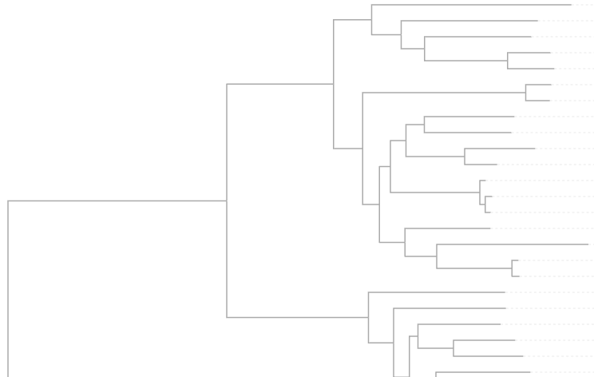

<center>Figure 5.23: node style not displayed when node type is set to empty</center>

### links

`object`

Display branch style.

```json
// This code relates to the elbow diagram in Figure 5.24
links = {
	// The branch type can be set as elbow, smooth and line, representing elbow, smooth curve and straight line respectively
	type: 'elbow', 
	style: {},
	formatter: function (select, data) {}
}
```


<center>Figure 5.24: elbow, smooth, line</center>

### legend

`object`

Display the legend

```json
// This code relates to figure 5.25
legend = {
	show: true,
    dx: 50,
    dy: 30,
    // Internal vertical spacing of the legend
    spacing: 10,
    style: {
        'font-size': 12,
        fill: '#333',
        'font-family': ''
    },
    // rect area
    rect: {
    	width: 40,
        height: 20,
        dx: -1400,
        dy: 0,
        style: {},
    },
    // text area
    text: {
        width: 20,
        height: 20,
        dx: -1400,
        dy: 0,
        style: {
            'text-anchor': "end"
        },
        formatter: function (select, text) {
            return text
        }
    },
    // Controls the rendering of the colors of all branch areas under the corresponding node
    data: [
    	{
        	name: "A",
            color: "#1f77b4"
        }, {
            name: "B",
            color: "#ff7f0e"
        }, {
            name: "E",
            color: "#2ca02c"
        }
    ]
}
```


<center>Figure 5.25: legend</center>

### tooltips

 `object`

tooltips.show： `boolean` , show tooltips if set true

tooltips.data： `object` , specific data

```json
// This code relates to tooltips
tooltip: {
    "show": true,
    "data": {
        "Halobacterium_salinarum_90.515%": [
            {
                "label": "qqq",
                "value": "Halobacterium"
            },
            {
                "label": "qqq",
                "value": "salinarum"
            },
            {
                "label": "qqq",
                "value": "90.515%"
            }
        ]
    }
}
```


<center>Figure 5.26: tooltips</center>

### sign

`object`

Display signs. The sub attributes are as follows:

sign.show：`boolean`, show signs

sign.dx：`number`, horizontal offset

sign.dy：`number`, vertical offset

sign.data：`array`,  set shape of signs and mapping them on leaves. 

By setting the type of each element in sign.data.data, the display of thermal, circular, rectangular, rectangular, rectangular, text, Y, cross, prismatic, triangular, star, pie, histogram, custom image, etc. can be supported

The following code can be mapped to the tree structure shown in Figure 2.1 to show heat sign.

```json
// Map to the tree structure shown in Figure 2.1 and set the sign map as heat sign, corresponding to Figure 5.27
sign = {
    show:true,
    dx:10,
    dy:0,
    data: [
        {
            label: { 
                spacing: 40,
            },
            data:{
                "A": {"type": "heatmap","data":[{"name":"ht1","style":{"font-size":"12px"}},{"name":"ht2","style":{"fill":"red","font-size":"12px"}},{"name":"ht3","style":{"fill":"green","font-size":"12px"}}]},
                "B": {"type": "heatmap","data":[{"name":"ht1","style":{"font-size":"12px"}},{"name":"ht2","style":{"fill":"yellow","font-size":"12px"}},{"name":"ht3","style":{"fill":"green","font-size":"12px"}}]},
                "C": {"type": "heatmap","data":[{"name":"ht1","style":{"font-size":"12px"}},{"name":"ht2","style":{"fill":"red","font-size":"12px"}},{"name":"ht3","style":{"fill":"green","font-size":"12px"}}]},
                "D": {"type": "heatmap","data":[{"name":"ht1","style":{"font-size":"12px"}},{"name":"ht2","style":{"fill":"red","font-size":"12px"}},{"name":"ht3","style":{"fill":"green","font-size":"12px"}}]},
                "E": {"type": "heatmap","data":[{"name":"ht1","style":{"font-size":"12px"}},{"name":"ht2","style":{"fill":"#ff0000","font-size":"12px"}},{"name":"ht3","style":{"fill":"green","font-size":"12px"}}]}
            }
        }
    ]
}
```


<center>Figure 5.27: heat sign</center>

```json
// Map to the tree structure shown in Figure 2.1, and set the sign to circle, corresponding to Figure 5.28
sign = {
    show:true,
    dx:10,
    dy:0,
    data: [
        {
            label : { 
                name: "circular shape",
                spacing: 40
            },
            data:{
                "A": {"type":"circle","name":"circle_1","size":1,"style":{"fill":"#00ff00"}},
                "B": {"type":"circle","name":"circle_1","size":1,"style":{"fill":"#ff0000"}},
                "C": {"type":"circle","name":"circle_1","size":1,"style":{"fill":"#0000ff"}},
                "D": {"type":"circle","name":"circle_1","size":1,"style":{"fill":"#ffff00"}},
                "E": {"type":"circle","name":"circle_1","size":1,"style":{"fill":"#0000ff"}}
            }
        }
    ]
}
```


<center>Figure 5.28: Circular sign</center>

```json
// Map to the tree structure shown in Figure 2.1 and set the sign to rectangle, corresponding to Figure 5.29
sign = {
    show:true,
    dx:10,
    dy:0,
    data: [
        {
            label : {
                name: "rectangular shape",
                spacing: 40
            },
            data:{
                "A": {"type":"rectangle","name":"rectangle","style":{"fill":"rgb(247, 190, 129)"}},
                "B": {"type":"rectangle","name":"rectangle","style":{"fill":"rgb(247, 190, 129)"}},
                "C": {"type":"rectangle","name":"rectangle","style":{"fill":"rgb(247, 190, 129)"}},
                "D": {"type":"rectangle","name":"rectangle","style":{"fill":"rgb(247, 190, 129)"}},
                "E": {"type":"rectangle","name":"rectangle","style":{"fill":"rgb(247, 190, 129)"}}
            }
        }
    ]
}
```

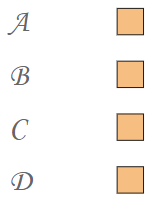

<center>Figure 5.29: rectangular sign</center>


```json
// Map to the tree structure shown in Figure 2.1, and set the flag to rect, corresponding to Figure 5.30
sign = {
    show:true,
    dx:10,
    dy:0,
    data: [
        {
            label : { 
                name: "rect sign",
                spacing: 40
            },
            data:{
                "A": {"type":"rect","name":"rect","size":1,"style":{"fill":"#ff0000"}},
                "B": {"type":"rect","name":"rect","size":1,"style":{"fill":"#00ff00"}},
                "C": {"type":"rect","name":"rect","size":1,"style":{"fill":"#0000ff"}},
                "D": {"type":"rect","name":"rect","size":1,"style":{"fill":"#ffff00"}},
                "E": {"type":"rect","name":"rect","size":1,"style":{"fill":"#00ffff"}}
            }
        }
    ]
}
```


<center>Figure 5.30: rect sign</center>

```json
// Map to the tree structure shown in Figure 2.1, and set the sign to text, corresponding to Figure 5.31
sign = {
    show:true,
    dx:10,
    dy:0,
    data: [
        {
            label : { 
                name: "text sign",
                spacing: 40
            },
            data:{
                "A": {"type":"text","name":"Q"},
                "B": {"type":"text","name":"C"},
                "C": {"type":"text","name":"E"},
                "D": {"type":"text","name":"R"},
                "E": {"type":"text","name":"T"}
            }
        }
    ]
}
```


<center>Figure 5.31: text sign</center>

```json
// Map to the tree structure shown in Figure 2.1, and set the sign to Y-shape, corresponding to Figure 5.32
sign = {
    show:true,
    dx:10,
    dy:0,
    data: [
        {
            label : { 
                name: "Y-shaped sign",
                spacing: 40
            },
            data:{
                "A": {"type":"wye","name":"wye","style":{"fill":"#ff0000"}},
                "B": {"type":"wye","name":"wye","style":{"fill":"#00ff00"}},
                "C": {"type":"wye","name":"wye","style":{"fill":"#0000ff"}},
                "D": {"type":"wye","name":"wye","style":{"fill":"#ffff00"}},
                "E": {"type":"wye","name":"wye","style":{"fill":"#00ffff"}}
            }
        }
    ]
}
```


<center>Figure 5.32: Y-shaped sign</center>

```json
// Map to the tree structure shown in Figure 2.1, and set the sign to cross, corresponding to Figure 5.33
sign = {
    show:true,
    dx:10,
    dy:0,
    data: [
        {
            label : { 
                name: "cross sign",
                spacing: 40
            },
            data:{
                "A": {"type":"cross","name":"cross","style":{"fill":"#ff0000"}},
                "B": {"type":"cross","name":"cross","style":{"fill":"#00ff00"}},
                "C": {"type":"cross","name":"cross","style":{"fill":"#0000ff"}},
                "D": {"type":"cross","name":"cross","style":{"fill":"#ffff00"}},
                "E": {"type":"cross","name":"cross","style":{"fill":"#00ffff"}}
            }
        }
    ]
}
```


<center>Figure 5.33: cross sign</center>

```json
// Map to the tree structure shown in Figure 2.1, and set the sign is set to prism, corresponding to Figure 5.34
sign = {
    show:true,
    dx:10,
    dy:0,
    data: [
        {
            label : { 
                name: "prism sign",
                spacing: 40
            },
            data:{
                "A": {"type":"diamond","name":"diamond","style":{"fill":"#ff0000"}},
                "B": {"type":"diamond","name":"diamond","style":{"fill":"#00ff00"}},
                "C": {"type":"diamond","name":"diamond","style":{"fill":"#0000ff"}},
                "D": {"type":"diamond","name":"diamond","style":{"fill":"#ffff00"}},
                "E": {"type":"diamond","name":"diamond","style":{"fill":"#00ffff"}}
            }
        }
    ]
}
```


<center>Figure 5.34: prism sign</center>

```json
// Map to the tree structure shown in Figure 2.1, and set the sign to triangular, corresponding to figure 5.35
sign = {
    show:true,
    dx:10,
    dy:0,
    data: [
        {
            label : { 
                name: "triangular sign",
                spacing: 40
            },
            data:{
                "A": {"type":"triangle","name":"triangle","style":{"fill":"#ff0000"}},
                "B": {"type":"triangle","name":"triangle","style":{"fill":"#00ff00"}},
                "C": {"type":"triangle","name":"triangle","style":{"fill":"#0000ff"}},
                "D": {"type":"triangle","name":"triangle","style":{"fill":"#ffff00"}},
                "E": {"type":"triangle","name":"triangle","style":{"fill":"#00ffff"}}
            }
        }
    ]
}
```


<center>Figure 5.35: triangular sign</center>

```json
// Map to the tree structure shown in Figure 2.1 and set the sign to star, corresponding to Figure 5.36
sign = {
    show:true,
    dx:10,
    dy:0,
    data: [
        {
            label : { 
                name: "star sign",
                spacing: 40
            },
            data:{
                "A": {"type":"star","name":"star","style":{"fill":"#ff0000"}},
                "B": {"type":"star","name":"star","style":{"fill":"#00ff00"}},
                "C": {"type":"star","name":"star","style":{"fill":"#0000ff"}},
                "D": {"type":"star","name":"star","style":{"fill":"#ffff00"}},
                "E": {"type":"star","name":"star","style":{"fill":"#00ffff"}}
            }
        }
    ]
}
```


<center>Figure 5.36: star sign</center>

```json
// Map to the tree structure shown in Figure 2.1 and set the sign to pie-shaped sign, corresponding to Figure 5.37
sign = {
    show:true,
    dx:10,
    dy:0,
    data: [
        {
            label : { 
                name: "pie-shaped sign",
                spacing: 40
            },
            data:{
                "A": {"type":"pie","name":"pie","data":[{"name":"gene1","value":1,"style":{"fill":"red","font-size":"12px"}},{"name":"gene2","value":1,"style":{"fill":"green","font-size":"12px"}},{"name":"gene3","value":1,"style":{"fill":"blue","font-size":"12px"}}]},
                "B": {"type":"pie","name":"pie","data":[{"name":"gene1","value":2,"style":{"fill":"red","font-size":"12px"}},{"name":"gene2","value":2,"style":{"fill":"green","font-size":"12px"}},{"name":"gene3","value":2,"style":{"fill":"blue","font-size":"12px"}}]},
                "C": {"type":"pie","name":"pie","data":[{"name":"gene1","value":1,"style":{"fill":"red","font-size":"12px"}},{"name":"gene2","value":2,"style":{"fill":"green","font-size":"12px"}},{"name":"gene3","value":3,"style":{"fill":"blue","font-size":"12px"}}]},
                "D": {"type":"pie","name":"pie","data":[{"name":"gene1","value":1,"style":{"fill":"red","font-size":"12px"}},{"name":"gene2","value":2,"style":{"fill":"green","font-size":"12px"}},{"name":"gene3","value":2,"style":{"fill":"blue","font-size":"12px"}}]},
                "E": {"type":"pie","name":"pie","data":[{"name":"gene1","value":1,"style":{"fill":"red","font-size":"12px"}},{"name":"gene2","value":2,"style":{"fill":"green","font-size":"12px"}},{"name":"gene3","value":2,"style":{"fill":"blue","font-size":"12px"}}]}
            }
        }
    ]
}
```


<center>Figure 5.37: pie-shaped sign</center>

```json
// Map to the tree structure shown in Figure 2.1, and set the sign to histogram, corresponding to Figure 5.38
sign = {
    show:true,
    dx:10,
    dy:0,
    data: [
        {
            label : { 
                name: "histogram",
                spacing: 40
            },
            data:{
                "A": {"type":"bar","name":"pie","data":[{"name":"gene1","value":10,"style":{"fill":"red",       "font-size":"12px"}},{"name":"gene2","value":10,"style":{"fill":"green","font-size":"12px"}},{"name":"gene3","value":10,"style":{"fill":"blue","font-size":"12px"}}]},
                "B": {"type":"bar","name":"pie","data":[{"name":"gene1","value":20,"style":{"fill":"red",       "font-size":"12px"}},{"name":"gene2","value":20,"style":{"fill":"green","font-size":"12px"}},{"name":"gene3","value":20,"style":{"fill":"blue","font-size":"12px"}}]},
                "C": {"type":"bar","name":"pie","data":[{"name":"gene1","value":10,"style":{"fill":"red",       "font-size":"12px"}},{"name":"gene2","value":20,"style":{"fill":"green","font-size":"12px"}},{"name":"gene3","value":30,"style":{"fill":"blue","font-size":"12px"}}]},
                "D": {"type":"bar","name":"pie","data":[{"name":"gene1","value":10,"style":{"fill":"red",       "font-size":"12px"}},{"name":"gene2","value":20,"style":{"fill":"green","font-size":"12px"}},{"name":"gene3","value":20,"style":{"fill":"blue","font-size":"12px"}}]},
                "E": {"type":"bar","name":"pie","data":[{"name":"gene1","value":10,"style":{"fill":"red",       "font-size":"12px"}},{"name":"gene2","value":20,"style":{"fill":"green","font-size":"12px"}},{"name":"gene3","value":20,"style":{"fill":"blue","font-size":"12px"}}]}
            }
        }
    ]
}
```


<center>Figure 5.38: histogram</center>

```json
// Set the sign to cutomized picture, relating to Figure 5.39
sign: {
    show: true,
    dx: 10,
    dy: 0,
    data: [
        {
            label: {
                name: "Cutomized picture",
                spacing: 40
            },
            "data": {
                "A": {
                    "type": "image",
                    "show": true,
                    "name": "a simple bird",
                    "href": "./bird.jpeg",
                    "rotate": 0,
                    "dx": 0
                }
            }
        }
    ]
}
```


<center>Figure 5.39: cutomized picture</center>

## 6 Online platform based on PhyloView

### 6.1 Overview

We have developed an online phylogenetic tree application platform based on PhyloView, which not only supports basic phylogenetic tree interaction, but also allows the smooth visualization of large phylogenetic trees with millions of nodes, supports the interaction of phylogenetic trees with geospatial information, statistical graphs and protein structure information, and allows users to create and share their own thematic content.

### 6.2 Visualization and interaction

#### 6.2.1 Simple tree visualization

Click the upload button and select Newick files:

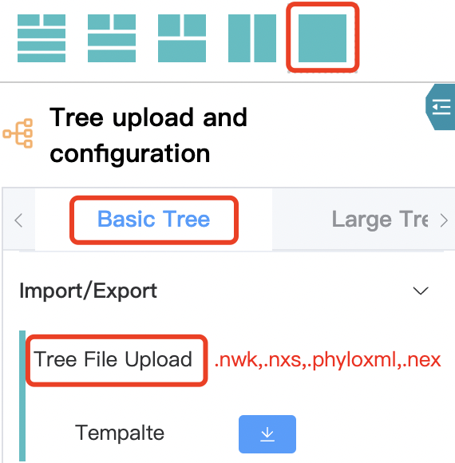

<center>Figure 6.1: upload tree files</center>

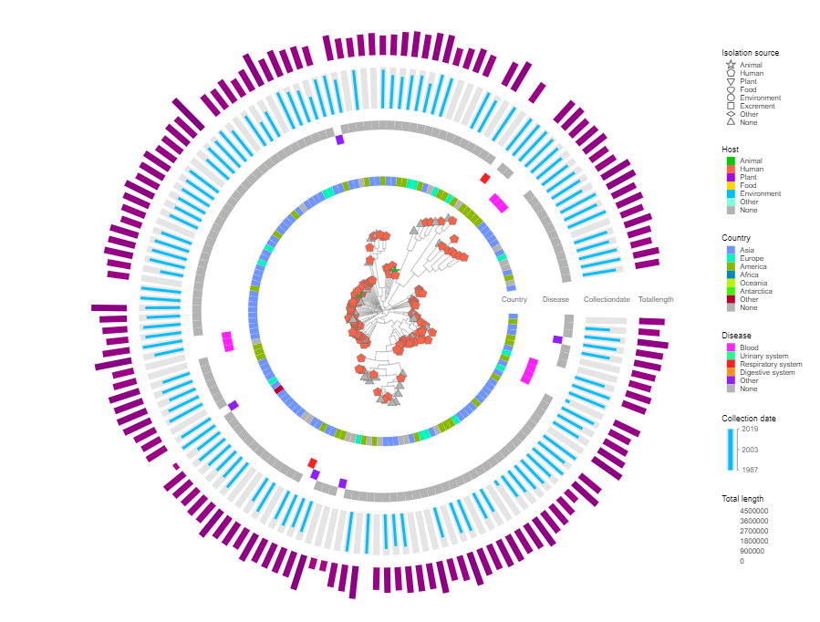

<center>Figure 6.2: a simple tree</center>

#### 6.2.2 Large tree visualization

Large tree visualization feature is build based on WebGL and Taxonium, so millions of nodes can be rendered smoothly.


<center>Figure 6.3: large tree</center>

#### 6.2.3 Interation with protein structure

Through uploading a tree file (Figure 6.1) and protein structure files (Figure 6.4), users can click the tree node to get protein structure information, as shown in Figure 6.5:


<center>Figure 6.4: upload tree files</center>

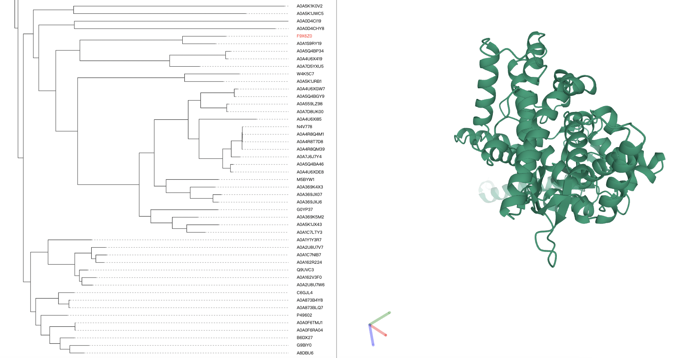

<center>Figure 6.5: click label to show current protein structure</center>

#### 6.2.4 Interaction with pathogen geospatial data

Through uploading the tree file (Figure 6.1) and editing the pathogen geospatial data (Figure 6.6), interaction between the tree and pathogen geospatial data can be conducted, as shown in Figure 6.7:

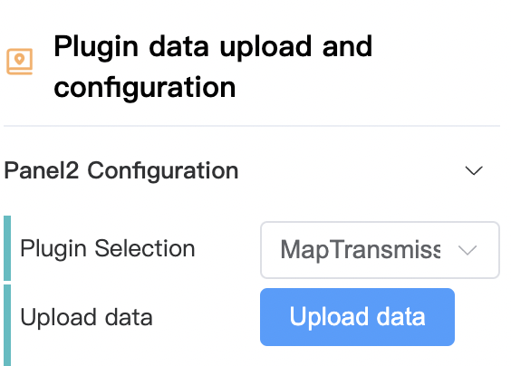

<center>Figure 6.6: editing pathogen geospatial data</center>


<center>Figure 6.7: pathogen geospatial visualization</center>

### 6.3 Content sharing

Login users are allowed to create links to share trees or other data designed themselves.

#### 6.3.1 Create a link

Login users can create a link for the current content, and other users can directly access the tree through this link:


<center>Figure 6.8: create a sharing link</center>

#### 6.3.2 Share a link

Users can view the link with permission:

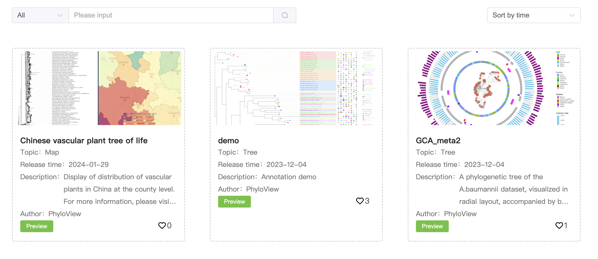

<center>Figure 6.9: view a list</center>