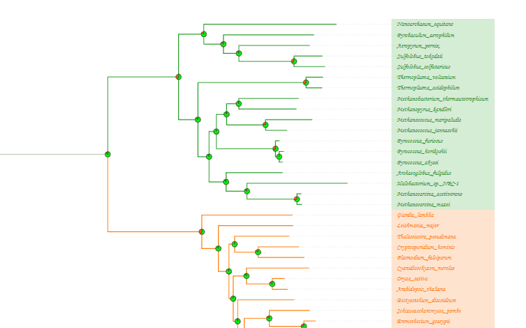
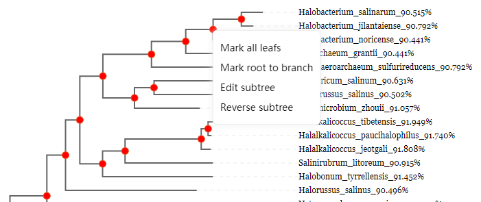
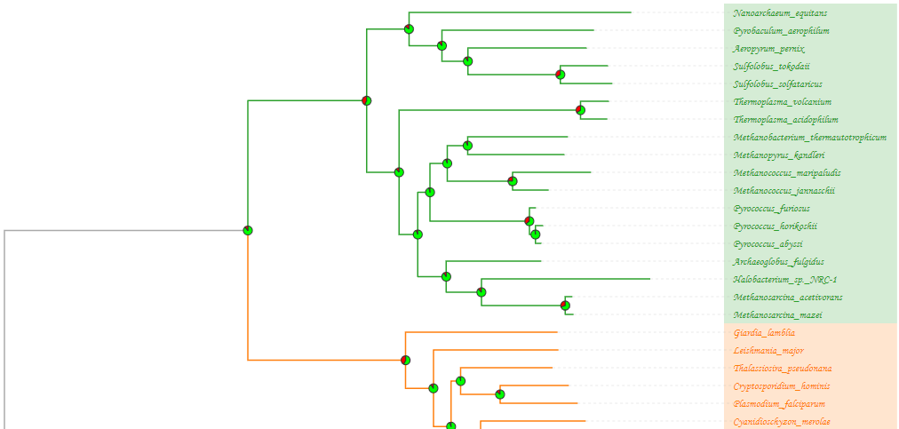
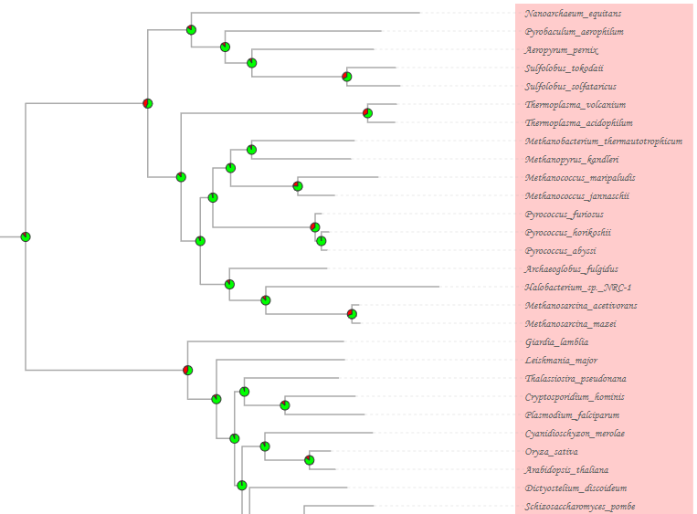
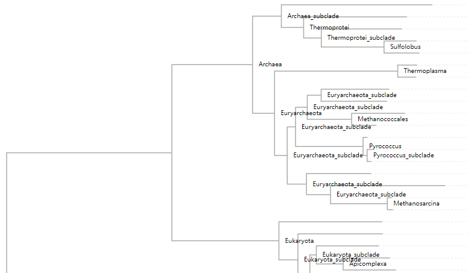
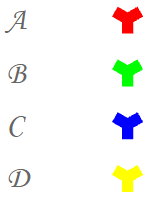

## 一、介绍

### 1.1 PhyloView是什么

[PhyloView](http://www.phyloview.cc/) 是一款基于 [d3.js](https://d3js.org/) 的用于可视化系统进化树的插件（以下简称“本插件”），支持导入 `Newick` 、 `NEXUS` 等格式的树文件，且具备选中分支、编辑子树、时间树展示、地图展示、进化支优化、树结构转换、字体切换、元数据展示、将进化树图像导出为 `SVG` 、 `PNG` 等功能。

### 1.2 快速安装

#### 1.2.1 引入PhyloView

创建一个`.html`文件，并通过以下任一方式引入[PhyloView](http://www.phyloview.cc/cdn/phyloview.js)。最新版支持 `CommonJS` 以及基础标签引入形式，对于生产环境，我们推荐链接到一个明确的版本号和构建文件，以避免新版本造成的不可预期的破坏。

```html
<!-- 方式一：在线引入PhyloView-->
<script src="http://www.darwintree.cn/PhyloView/phyloview.main.js"></script>

<!-- 方式二：本地引入PhyloView-->
<script src="./phyloview.main.js"></script>
```

示例如下：

```html
<!DOCTYPE html>
<html lang="en">

<head>
    <meta charset="UTF-8">
    <meta http-equiv="X-UA-Compatible" content="IE=edge">
    <meta name="viewport" content="width=device-width, initial-scale=1.0">
    <title>Rectangular</title>
</head>

<body>
    <div id="dendrogram"></div>
    <script src="http://www.darwintree.cn/PhyloView/phyloview.main.js"></script>
    <script>
        new phyloview.InitTreeStructure("#dendrogram", {
            "content": "(A:0.1,(B:0.3,C:0.4)D:0.5)E;"
        })
    </script>
</body>

</html>
```

将包含该内容的文件命名为`index.html`，用浏览器打开`index.html`，将出现如图1.1所示的进化树：


<center>图1.1：成功引入后PhyloView后，index.html所对应的图像</center>

#### 1.2.2 Modules

`PhyloView` 基于 `ES2015 modules (opens new window)`开发. 可以使用 `Rollup`, `webpack` 或者其他你偏爱的打包工具进行构建. 在一个符合 `ES2015` 的应用中导入 `PhyloView` 或者 `PhyloView` 的某些模块，可点击 [PhyloView](http://www.phyloview.cc/cdn/phyloview.js) 下载到本地后引入

```js
import { InitTreeStructure } from "phyloview.js";
```

#### 1.2.3 支持的环境

`PhyloView` 支持最新浏览器，比如 `Chrome`，`Edge`，`Firefox` 以及 `Safari`。

## 二、数据导入和树结构导出

### 2.1 概况

本插件支持多种导入格式和多种导出格式，支持的导入格式包括Newick、Nexus、PhyloXML、NeXML，支持的导出格式包括SVG、PNG格式。

### 2.2 导入文件

#### 2.2.1 Newick

Newick格式是进化树中常见的一种树格式，如下的Newick文本，即表示图2.1所示的树：

```json
(A:0.1,B:0.2,(C:0.3,D:0.4)E:0.5)F;
```

其中，括号表示内部节点，比如 `(C:0.3,D:0.4)E:0.5` ，意思是节点C、节点D会经过路径汇总到节点E上，冒号后的数字表示分支的长度：

/Newick.png)

<center>图2.1：一棵普通的树</center>

http://www.phylosoft.org/NHX/)

#### 2.2.2 Nexus

Nexus是一种流行的文件格式，许多应用程序都支持此格式。Nexus 文件一般具有 `.nxs` 或 `.nex` 扩展名。以下的Nexus文件示例可以用于表示图2.1所示的树

```
#NEXUS
BEGIN TAXA;
      Dimensions NTax=6;
      TaxLabels A B C D E F;
END;
BEGIN TREES;
      Tree best=(A:0.1,B:0.2,(C:0.3,D:0.4)E:0.5)F;
END;
```

在Nexus文件中，第一行必须以 `#NEXUS` 开头，此外，Nexus是利用块（block）来存储数据的，比如**TAXA block**、**DATA block**、**TREES block**，每个块都以 `BEGIN` 为开始， `END` 为结束，其中，TAXA block是**必不可少**的。在上述Nexus示例中，一共使用了TAXA、TREES这两个block，它们分别定义了A~F合计6个标签、定义了一棵树。[点击此处查看Nexus说明](http://wiki.christophchamp.com/index.php?title=NEXUS_file_format)。

#### 2.2.3 PhyloXML

PhyloXML是一种用于描述进化树和相关数据的XML语言，以下的PhyloXML文本可用于表示图2.1的树。

```xml
<?xml version="1.0" encoding="UTF-8"?>
<phyloxml xmlns="http://www.phyloxml.org" xmlns:xsi="http://www.w3.org/2001/XMLSchema-instance" xsi:schemaLocation="http://www.phyloxml.org http://www.phyloxml.org/1.00/phyloxml.xsd">
<phylogeny rooted="true">
   <clade>
	  <name>F</name>
      <clade branch_length = "0.1">
           <name>A</name>
      </clade>
	  <clade branch_length = "0.2">
           <name>B</name>
      </clade>
      <clade branch_length = "0.5">
         <name>E</name>
         <clade branch_length = "0.3">
               <name>C</name>
         </clade>
         <clade branch_length = "0.4">
               <name>D</name>
         </clade>
      </clade>
   </clade>
</phylogeny>
</phyloxml>
```

不难看出，如果只是想描述一棵简单的树，那么使用PhyloXML会使得这个过程变得复杂且不太适用。[点击此处查看PhyloXML更多信息](https://bmcbioinformatics.biomedcentral.com/articles/10.1186/1471-2105-10-356)

#### 2.2.4 NeXML

NeXML是一种基于XML的格式，下列的NeXML文本可以用来表示图2.1所示的树结构

```xml
<nex:nexml xmlns:dc="http://purl.org/dc/elements/1.1/" xmlns:xsd="http://www.w3.org/2001/XMLSchema#" xmlns:map="http://phylomap.org/terms.owl#" xmlns="https://nexml.github.io/2009" xmlns:nex="https://nexml.github.io/2009" xmlns:xsi="http://www.w3.org/2001/XMLSchema-instance" xmlns:rdf="http://www.w3.org/1999/02/22-rdf-syntax-ns#" generator="Bio::Phylo::Project v.0.58" version="0.9" xsi:schemaLocation="https://nexml.github.io/2009 https://nexml.github.io/2009/nexml.xsd">
<otus id="os10">
	<otu id="ou11" label="A"/>
	<otu label="B" id="ou12"/>
	<otu label="C" id="ou13"/>
	<otu label="D" id="ou14"/>
</otus>
<trees otus="os10" id="ts2">
	<tree id="te3" xsi:type="nex:FloatTree">
		<node id="ne4" root="true" label="F"/>
		<node id="ne5" otu="ou11" label="A"/>
		<node otu="ou12" label="B" id="ne6"/>
		<node id="ne7" label="E"/>
		<node id="ne8" otu="ou13" label="C"/>
		<node id="ne9" label="D" otu="ou14"/>
		<edge source="ne4" id="edge5" target="ne5" length="0.1"/>
		<edge id="edge6" target="ne6" length="0.2" source="ne4"/>
		<edge id="edge7" target="ne7" length="0.5" source="ne4"/>
		<edge source="ne7" target="ne8" id="edge8" length="0.3"/>
		<edge source="ne7" length="0.4" target="ne9" id="edge9"/>
	</tree>
</trees>
</nex:nexml>
```

[NeXML官网](https://nexml.github.io/)还提供了NeXML格式验证、 `Nexus->NeXML` 、 `Newick->NeXML` 、 `NeXML->json` 、 `NeXML->rdf` 等功能。关于NeXML格式的说明，可以[点击此处查看详情](https://github.com/nexml/nexml/wiki/NeXML-Manual)

### 2.3 导出文件

#### 2.3.1 SVG

SVG是一种用XML定义的矢量图形格式，其在放大过程中，图像质量不会受到影响。此外，SVG的文件大小较PNG、JPEG等更小，更易于网络传输

#### 2.3.2 PNG

PNG是一种位图格式，采用无损压缩算法，故可以在保证图像质量的前提下压缩图像大小、支持透明效果。

此外，本插件还支持将进化树导出为Newick、Nexus、PhyloXML、NeXML格式的树结构文件。

## 三、进化树展示

### 3.1 概况

通过 `phyloview.InitTreeStructure()` 可视化进化树， `InitTreeStructure` 的第二个参数为 `object` 类型，包含进化树的各个参数，这些参数可以用来控制展示/隐藏节点名称、调整图例样式、调整分枝样式、调整叶节点标签样式等。

### 3.2 基本设置

基本设置支持对进化树的基本内容进行展示/隐藏，包括节点名称、支持度、图形、分枝长度、叶子区域的遮罩、图例、滚轮功能。

#### 3.2.1 内节点名称/支持度

以**内节点名称/支持度**为例，开启显示功能后其效果如图3.1所示：


<center>图3.1：显示内节点名称/支持度</center>

#### 3.2.2 支长

支持展示分支长度，开启后可以在分支旁展示支长：


<center>图3.2：显示支长</center>

#### 3.2.3 树结构排序

树结构排序一共支持6种排序方式，分别是默认升序、默认降序、分支长度升序、分支长度降序、名称升序、名称降序。


<center>图3.3：按分支长度升序/降序排列</center>


<center>图3.4：按分支名称升序/降序排列</center>

#### 3.2.4 X轴Y轴缩放

本插件支持对进化树在X轴、Y轴分别进行缩放操作，其**缩放值越大**，则进化树在该轴上的**长度越长**。


<center>图3.5：X轴缩放对比图</center>


<center>图3.6：Y轴缩放对比图</center>

#### 3.2.5 遮罩

遮罩功能开启后，进化树右侧叶节点区域将展示不透明的遮罩


<center>图3.7：遮罩示例</center>

### 3.3 样式控制

PhyloView支持图例功能，并支持对分支、枝叶、内部节点的类型和样式进行修改

#### 3.3.1 图例样式

图例样式功能支持对进化树右侧的图例进行区域分割、颜色调整。开启前后的效果见图3.8


<center>图3.8：图例样式功能(左侧为关闭，右侧为启用)</center>

#### 3.3.2 分支样式

分支支持调整粗细、颜色，但注意如果同时启用了**图例展示**功能，则**分支样式**的颜色调整功能将不起作用


<center>图3.9：不同分支样式下的进化树</center>

同时也支持对虚线的样式进行调整，如图3.10所示


<center>图3.10：颜色为<font color="blue">蓝色</font>的虚线样式</center>

#### 3.3.3 分支类型

分支支持肘状、平滑、直线三种显示类型。效果见图3.11


<center>图3.11：从左往右，依次为肘状、平滑、直线</center>

#### 3.3.4 枝叶样式

枝叶样式修改支持自定义叶节点标签上的字体类型、字体颜色、字体大小。需要注意的是，如果开启了**图例展示**功能，则叶节点的颜色自定义功能将被其覆盖，导致颜色更改不起作用


<center>图3.12：不同枝叶样式下的进化树</center>

#### 3.3.5 节点圆样式

节点支持根据数据显示饼状图、填充圆、empty，如图3.13~3.15所示


<center>图3.13：节点显示饼状图</center>


<center>图3.14：节点显示填充圆</center>


<center>图3.15：节点类型为emtpy</center>

### 3.4 元数据

对元数据的支持包括位于进化树中的tooltips和右侧标志区域的signs

#### 3.4.1 Tooltips

鼠标移动到叶节点名称上，会出现tooltips，如图3.16所示


<center>图3.16：tooltips示例</center>

#### 3.4.2 Signs

支持在进化树右侧以柱状图、饼图、十字形等标志的展示


<center>图3.17：signs示例</center>

### 3.5 分支优化配置

支持使用不同的比例尺展示分支长度，即对于同一棵树的不同分支，使用不同的缩放比例，可以更清楚地看到各个分支的区别


<center>图3.18：多比例尺展示分支长度（<font color="blue">蓝色</font>的支长被扩大为原始长度的10倍，<font color="red">红色</font>的支长同样被扩大为原始长度的10倍）</center>

## 四、进化树的操作

### 4.1 概况

在进化树的展示区域，本插件支持对其进行可视化操作，如选中节点/分支、树结构转换、拖动图形区域等

### 4.2 缩放和拖拽

开启缩放和拖拽功能后，可以对进化树可视化区域进行拖拽和缩放



<center>图4.1：缩放和拖拽功能示例</center>

### 4.3 进化树拓扑

支持以线性结构、环形结构显示进化树


<center>图4.2：线性结构</center>


<center>图4.3：环形结构</center>

### 4.4 快捷操作

支持标记子树分支、标记当前节点到根的路径、编辑子树、翻转子树、重置树、导出选中的分支、下载Newick结构



<center>图4.4：鼠标右键点击内部节点弹出的快捷菜单</center>


<center>图4.5：鼠标右键点击其它区域弹出的快捷菜单</center>

## 五、基础配置项

配置项参数所在的位置如图5.1所示，用法如下


<center>图5.1：传入的内容即为config对象</center>

### content

 `string`

进化树的内容，支持Newick、Nexus、PhyloXML、NeXML格式，如下的代码目的是将Newick格式的进化树填入content中，其代表的树形结构见图2.1

```json
content: "(A:0.1,B:0.2,(C:0.3,D:0.4)E:0.5)F";
```

### width

 `number`

设定画布的宽度，默认为1600，如果设定值过小，会导致树结构显示不全


<center>图5.2：width对比图</center>

### height

 `number`

设定画布的高度，与 `width` 类似，若设定值太小，将导致树结构显示不全

### sort

 `string`

设定树结构的排序方式，一共有6种可选的排序方式，分别是 `defaultAsc` 、 `defaultDes` 、 `nameDes` 、 `nameAsc` 、 `lengthDes` 、 `lengthAsc` ，其中， `defaultAsc` 、 `defaultDes` 会按照节点所在的层级来排序。下式代码即表示按节点名称降序排列，结果如图5.4所示

```json
sort: "nameDes"
```


<center>图5.3：节点按名称降序顺序排列</center>

### size

 `array`

至多填入两个值，其中，size[0]控制画布横向拉伸值，size[1]控制画布宽度，且size[1]为选填内容，如下代码所示

```json
// 横向拉伸值800，画布宽度400
size: [800, 400]
// 横向拉伸值400，此时画布宽度为config.width的值
size: [400]
```


<center>图5.4：横向拉伸对比</center>

### position

 `array`

控制页面渲染完成后，进化树初始位置的左边距和上边距，示例如下

```json
// 左边距20，上边距100
position: [20, 100]
```


<center>图5.5：position对比</center>

### separation

 `number`

控制纵向拉伸值，范围为[0, 20]，值越大，进化树的纵向显示长度越长

```json
// 纵向拉伸值设置为10
separation: 10
```


<center>图5.6：纵向拉伸对比</center>

### scale

 `number`

整体拉伸倍率，值越大，进化树的横向宽度和纵向高度越大

```json
// 拉伸倍率
scale: 1.2
```


<center>图5.7：纵向拉伸对比图</center>

### stretch

 `object`

stretch.show： `boolean` ，是否启用分支优化功能

stretch.data： `boolean` ，分支范围和缩放倍率

分支优化配置，对于范围内的分支，指定缩放倍率，并设定样式，被缩放的分支将以虚线的形式出现

```json
// 对长度在[0.001,0.003),[0.003,0.005),[0.005,0.008)范围内的分支分别放大1,2,3倍
stretch: {
    "show": true,
    "data": [
        {
            "range": [
                0.001,
                0.003
            ],
            "multiple": 1,
            "color": "red"
        },
        {
            "range": [
                0.003,
                0.005
            ],
            "multiple": 2,
            "color": "blue"
        },
        {
            "range": [
                0.005,
                0.008
            ],
            "multiple": 3,
            "color": "green"
        }
    ]
}
```


<center>图5.8：分支优化效果</center>

### isCollapsible

 `boolean`

是否允许子树折叠，开启后，点击进化树的任意非根节点，即可折叠子树，如图5.9、5.10所示

```json
// 允许子树折叠
isCollapsible: true
```


<center>图5.9：点击节点可以折叠子树</center>


<center>图5.10：折叠效果</center>

若要恢复进化树折叠前的样貌，则点击右侧的折叠符号，如图5.11所示


<center>图5.11：恢复折叠前的显示需点击三角符号</center>

### isPhylogram

 `boolean`

是否按长度展示支长，若为false，则全部叶分支对齐右侧；为true，则按分支长度展示分支。如图5.12、图5.13所示


<center>图5.12：isPhylogram=false，叶分支全部右对齐</center>



<center>图5.13：isPhylogram=true，按分支长度展示分支</center>

### isWheelZoom

 `boolean`

为true时启用滚轮缩放、进化树拖动功能


<center>图5.14：滑动滚轮可以缩放进化树，点击可以拖动画面</center>

### style

 `object`

画布的全局文本样式，可被其它样式覆盖

style["font-family"]： `string` 类型，字体族名，可置空，或设置为以下可选值 `["Aria"、"Georgia"、"Verdana"、"Courier"、"Courier New"、"Times New Roman"、"Impact、Monotype Corsiva"]` ，

style.fill： `string` 类型，填充颜色

style["font-size"]： `string` 类型，设置字体大小

如下的配置对应图5.15所示的字体

```json
// 设置字体集为Monotype Corsiva，并以红颜色填充，字体大小10px
style: {
	'font-family': "Arial",
	'fill': 'red',
    'font-size': "10px",
}
```


<center>图5.15：全局字体样式</center>

### leafs

 `object`

用于控制叶子区域的展示，内部参数如下

leafs.show： `boolean` 类型，是否显示叶子区域

leafs.dx： `number` 类型，叶子区域横向偏移量

leafs.dy： `number` 类型，叶子区域纵向偏移量

leafs.style： `object` 类型，控制叶子区域的文本样式

leafs.formatter： `function` 类型，回调函数，参数select是d3.select返回的实例，data为d3遍历单个叶节点的数据，可用于自定义显示效果

如下的代码，对应图5.16中的节点样式

```json
leafs: {
	show: true,
	dx: 0,
	dy: 0,
	style: {
        // 以蓝色填充字体
		fill: 'blue',
        // 注意，此处应当是number类型，不能写成"12px"，与其它地方的style不一样
		'font-size': 12,
		'font-family': "Monotype Corsiva"
	},
    // 回调函数
	formatter: function (select, data) {
        // 若分支长度大于0.5，则label大小为20px，颜色设置为红色
        if (data.data.length > 0.5) {
        	select.attr("font-size", "20px")
        	select.attr("fill", "red")
        }
	}
}
```


<center>图5.16：叶节点样式</center>

### extension

 `object`

控制虚线相关属性

```json
extension: {
    // 默认为true，若为false，会导致进化树无法显示
	show: true,
    // 虚线样式
	style: {
		stroke: '#aaa',
		'stroke-dasharray': 3,
		'stroke-width': 1,
	}
}
```

### mask

 `object`

控制叶子节点遮罩，内部参数如下

mask.show： `boolean` 类型，是否显示叶子节点遮罩

mask.dx： `number` 类型，叶子节点遮罩横向偏移量

mask.dy： `number` 类型，叶子节点遮罩纵向偏移量

mask.padding： `array` 类型，叶子节点遮罩内边距

mask.style： `object` 类型，控制叶子节点遮罩的样式

```json
mask: {
	show: true,
	dx: 0,
	dy: 0,
	padding: [10, 10],
	style: {
		opacity: 0.2
	}
}
```



<center>图5.17：叶子节点遮罩样式</center>

### nodes

 `object`

控制节点相关显示，以下是其子属性

nodes.value： `object` ，控制节点支持度的显示

nodes.collapse： `object` ，控制三角形折叠符号的显示

nodes.name： `object` ，控制节点名称的显示

nodes.shape： `object` ，控制节点形状

```json
// 该配置对应图5.18
nodes: {
    value: {
        //控制是否显示show: false,
        //横向偏移量dx: -10,
        //纵向偏移量dy: -5,
        //样式style: {
            "text-anchor": 'end',
            fill: '#000',
            'font-size': 10,
            'font-family': "sans-serif"
        }
        //回调函数
    	formatter: function(select,data){}
    }
}
```


<center>图5.18：节点支持度</center>

```json
// 该配置对应图5.19
nodes: {
    collapse: {
        //三角形折叠符号横向偏移量dx: 0,
        //三角形折叠符号纵向偏移量dy: 0,
        //三角形折叠符号旋转角度，大于0表示顺时针旋转角度，小于0则逆时针旋转角度rotate: 0,
        //三角形折叠符号的宽度、高度size: [
            30,
            15
        ],
        style: {
            fill: 'lime',
            stroke: 'purple',
            'stroke-width': 1,
            cursor: 'pointer'
        }
    	//回调函数
	    formatter: function(select, data){}
    }
}
```


<center>图5.19：右侧三角形折叠符号</center>

```json
// 该配置对应图5.20
nodes: {
    name: {
        show: false,
        dx: 10,
        dy: 3,
        style: {
            "text-anchor": 'start',
            fill: '#000',
            'font-size': 10,
            'font-family': "sans-serif"
        },
        formatter: function(select, data){}
    }
}
```



<center>图5.20：节点名称</center>

```json
// 该配置对应图5.21
nodes: {
    shape: {
        //类型：可设置为pie、circle，若空置该属性，则不显示节点
        type: 'pie',
        //横向偏移
        dx: 0,
        //纵向偏移
        dy: 0,
        style: {
            "stroke-width": 1,
            fill: 'rgb(255, 120, 57)',
            stroke: "#333",
            cursor: 'pointer'
        },
        //type设置为circle时的配置
    	circle: {
            //半径
            r: 5,
            style: {
                fill: 'red'
            },
            //回调函数
            formatter: function(select, data){}
        },
        //type设置为pie时的配置
    	pie: {
            color: [
                'rgb(0, 255, 0)', 
                'red'
            ],
            //内圆半径
    		innerRadius: 0,
            //外圆半径
    		outerRadius: 5,
            style: {},
            //回调函数
			formatter: function(select, data){}
        }
    }
}
```


<center>图5.21：节点类型设置为pie时的节点形状</center>


<center>图5.22：节点类型设置为circle时的节点形状</center>


<center>图5.23：节点类型空置时不显示节点样式</center>

### links

 `object`

控制分支的展示样式

```json
// 该配置对应图5.24中的肘状图
links: {
	// 分支的类型，可设定为elbow、smooth、line，分别代表肘状、平滑曲线、直线
	type: 'elbow', 
	style: {},
	formatter: function (select, data) {}
}
```


<center>图5.24：肘状、平滑曲线、直线</center>

### legend

 `object`

控制图例的相关显示

```json
// 该配置对应图5.25
legend: {
	show: true,
    dx: 50,
    dy: 30,
    // 图例说明区域的内部垂直间隔
    spacing: 10,
    style: {
        'font-size': 12,
        fill: '#333',
        'font-family': ''
    },
    // 图例说明区域的矩形设置
    rect: {
    	width: 40,
        height: 20,
        dx: -1400,
        dy: 0,
        style: {},
    },
    // 图例说明区域的文本设置
    text: {
        width: 20,
        height: 20,
        dx: -1400,
        dy: 0,
        style: {
            'text-anchor': "end"
        },
        formatter: function (select, text) {
            return text
        }
    },
    // 控制相应节点下所有分支区域的颜色的渲染
    data: [
    	{
        	name: "A",
            color: "#1f77b4"
        }, {
            name: "B",
            color: "#ff7f0e"
        }, {
            name: "E",
            color: "#2ca02c"
        }
    ]
}
```


<center>图5.25：图例效果</center>

### tooltips

 `object`

tooltips.show： `boolean` ，是否展示tooltips

tooltips.data： `object` ，具体数据

```json
// 该配置对应下图所示的tooltips
tooltip: {
    "show": true,
    "data": {
        "Halobacterium_salinarum_90.515%": [
            {
                "label": "qqq",
                "value": "Halobacterium"
            },
            {
                "label": "qqq",
                "value": "salinarum"
            },
            {
                "label": "qqq",
                "value": "90.515%"
            }
        ]
    }
}
```


<center>图5.26：tooltips</center>

### sign

 `object`

控制右侧的标志的展示，子属性如下

sign.show： `boolean` ，是否展示标志

sign.dx： `number` ，横向偏移

sign.dy： `number` ，纵向偏移

sign.data： `array` ，具体展示的数据，包括映射、样式

通过设定sign.data.data中每个元素的type，可支持热力、圆形、矩形、矩状、文本、Y形、十字、棱形、三角、星形、饼状、直方、自定义图片等的展示

下示代码可映射到图2.1所示的树结构上，并展示热力标志

```json
// 映射到图2.1所示树结构，并设置标志图为热力标志,对应图5.27
sign: {
    show:true,
    dx:10,
    dy:0,
    data: [
        {
            label: { 
                spacing: 40,
            },
            data:{
                "A": {"type": "heatmap","data":[{"name":"ht1","style":{"font-size":"12px"}},{"name":"ht2","style":{"fill":"red","font-size":"12px"}},{"name":"ht3","style":{"fill":"green","font-size":"12px"}}]},
                "B": {"type": "heatmap","data":[{"name":"ht1","style":{"font-size":"12px"}},{"name":"ht2","style":{"fill":"yellow","font-size":"12px"}},{"name":"ht3","style":{"fill":"green","font-size":"12px"}}]},
                "C": {"type": "heatmap","data":[{"name":"ht1","style":{"font-size":"12px"}},{"name":"ht2","style":{"fill":"red","font-size":"12px"}},{"name":"ht3","style":{"fill":"green","font-size":"12px"}}]},
                "D": {"type": "heatmap","data":[{"name":"ht1","style":{"font-size":"12px"}},{"name":"ht2","style":{"fill":"red","font-size":"12px"}},{"name":"ht3","style":{"fill":"green","font-size":"12px"}}]},
                "E": {"type": "heatmap","data":[{"name":"ht1","style":{"font-size":"12px"}},{"name":"ht2","style":{"fill":"#ff0000","font-size":"12px"}},{"name":"ht3","style":{"fill":"green","font-size":"12px"}}]}
            }
        }
    ]
}
```


<center>图5.27：热力标志</center>

```json
// 映射到图2.1所示树结构，并设置标志图为圆形标志,对应图5.28
sign: {
    show:true,
    dx:10,
    dy:0,
    data: [
        {
            label : { 
                name: "圆形标志",
                spacing: 40
            },
            data:{
                "A": {"type":"circle","name":"circle_1","size":1,"style":{"fill":"#00ff00"}},
                "B": {"type":"circle","name":"circle_1","size":1,"style":{"fill":"#ff0000"}},
                "C": {"type":"circle","name":"circle_1","size":1,"style":{"fill":"#0000ff"}},
                "D": {"type":"circle","name":"circle_1","size":1,"style":{"fill":"#ffff00"}},
                "E": {"type":"circle","name":"circle_1","size":1,"style":{"fill":"#0000ff"}}
            }
        }
    ]
}
```


<center>图5.28：圆形标志</center>

```json
// 映射到图2.1所示树结构，并设置标志图为矩形标志,对应图5.29
sign: {
    show:true,
    dx:10,
    dy:0,
    data: [
        {
            label : {
                name: "矩形标志",
                spacing: 40
            },
            data:{
                "A": {"type":"rectangle","name":"rectangle","style":{"fill":"rgb(247, 190, 129)"}},
                "B": {"type":"rectangle","name":"rectangle","style":{"fill":"rgb(247, 190, 129)"}},
                "C": {"type":"rectangle","name":"rectangle","style":{"fill":"rgb(247, 190, 129)"}},
                "D": {"type":"rectangle","name":"rectangle","style":{"fill":"rgb(247, 190, 129)"}},
                "E": {"type":"rectangle","name":"rectangle","style":{"fill":"rgb(247, 190, 129)"}}
            }
        }
    ]
}
```


<center>图5.29：矩形标志</center>

```json
// 映射到图2.1所示树结构，并设置标志图为矩状标志,对应图5.30
sign: {
    show:true,
    dx:10,
    dy:0,
    data: [
        {
            label : { 
                name: "矩状标志",
                spacing: 40
            },
            data:{
                "A": {"type":"rect","name":"rect","size":1,"style":{"fill":"#ff0000"}},
                "B": {"type":"rect","name":"rect","size":1,"style":{"fill":"#00ff00"}},
                "C": {"type":"rect","name":"rect","size":1,"style":{"fill":"#0000ff"}},
                "D": {"type":"rect","name":"rect","size":1,"style":{"fill":"#ffff00"}},
                "E": {"type":"rect","name":"rect","size":1,"style":{"fill":"#00ffff"}}
            }
        }
    ]
}
```


<center>图5.30：矩状标志</center>

```json
// 映射到图2.1所示树结构，并设置标志图为文本标志,对应图5.31
sign: {
    show:true,
    dx:10,
    dy:0,
    data: [
        {
            label : { 
                name: "文本标志",
                spacing: 40
            },
            data:{
                "A": {"type":"text","name":"Q"},
                "B": {"type":"text","name":"C"},
                "C": {"type":"text","name":"E"},
                "D": {"type":"text","name":"R"},
                "E": {"type":"text","name":"T"}
            }
        }
    ]
}
```


<center>图5.31：文本标志</center>

```json
// 映射到图2.1所示树结构，并设置标志图为Y形标志,对应图5.32
sign: {
    show:true,
    dx:10,
    dy:0,
    data: [
        {
            label : { 
                name: "Y形标志",
                spacing: 40
            },
            data:{
                "A": {"type":"wye","name":"wye","style":{"fill":"#ff0000"}},
                "B": {"type":"wye","name":"wye","style":{"fill":"#00ff00"}},
                "C": {"type":"wye","name":"wye","style":{"fill":"#0000ff"}},
                "D": {"type":"wye","name":"wye","style":{"fill":"#ffff00"}},
                "E": {"type":"wye","name":"wye","style":{"fill":"#00ffff"}}
            }
        }
    ]
}
```



<center>图5.32：Y形标志</center>

```json
// 映射到图2.1所示树结构，并设置标志图为十字标志,对应图5.33
sign: {
    show:true,
    dx:10,
    dy:0,
    data: [
        {
            label : { 
                name: "十字标志",
                spacing: 40
            },
            data:{
                "A": {"type":"cross","name":"cross","style":{"fill":"#ff0000"}},
                "B": {"type":"cross","name":"cross","style":{"fill":"#00ff00"}},
                "C": {"type":"cross","name":"cross","style":{"fill":"#0000ff"}},
                "D": {"type":"cross","name":"cross","style":{"fill":"#ffff00"}},
                "E": {"type":"cross","name":"cross","style":{"fill":"#00ffff"}}
            }
        }
    ]
}
```


<center>图5.33：十字标志</center>

```json
// 映射到图2.1所示树结构，并设置标志图为棱形标志,对应图5.34
sign: {
    show:true,
    dx:10,
    dy:0,
    data: [
        {
            label : { 
                name: "棱形标志",
                spacing: 40
            },
            data:{
                "A": {"type":"diamond","name":"diamond","style":{"fill":"#ff0000"}},
                "B": {"type":"diamond","name":"diamond","style":{"fill":"#00ff00"}},
                "C": {"type":"diamond","name":"diamond","style":{"fill":"#0000ff"}},
                "D": {"type":"diamond","name":"diamond","style":{"fill":"#ffff00"}},
                "E": {"type":"diamond","name":"diamond","style":{"fill":"#00ffff"}}
            }
        }
    ]
}
```


<center>图5.34：棱形标志</center>

```json
// 映射到图2.1所示树结构，并设置标志图为三角形标志,对应图5.35
sign: {
    show:true,
    dx:10,
    dy:0,
    data: [
        {
            label : { 
                name: "三角形标志",
                spacing: 40
            },
            data:{
                "A": {"type":"triangle","name":"triangle","style":{"fill":"#ff0000"}},
                "B": {"type":"triangle","name":"triangle","style":{"fill":"#00ff00"}},
                "C": {"type":"triangle","name":"triangle","style":{"fill":"#0000ff"}},
                "D": {"type":"triangle","name":"triangle","style":{"fill":"#ffff00"}},
                "E": {"type":"triangle","name":"triangle","style":{"fill":"#00ffff"}}
            }
        }
    ]
}
```


<center>图5.35：三角形标志</center>

```json
// 映射到图2.1所示树结构，并设置标志图为星形标志,对应图5.36
sign: {
    show:true,
    dx:10,
    dy:0,
    data: [
        {
            label : { 
                name: "星形标志",
                spacing: 40
            },
            data:{
                "A": {"type":"star","name":"star","style":{"fill":"#ff0000"}},
                "B": {"type":"star","name":"star","style":{"fill":"#00ff00"}},
                "C": {"type":"star","name":"star","style":{"fill":"#0000ff"}},
                "D": {"type":"star","name":"star","style":{"fill":"#ffff00"}},
                "E": {"type":"star","name":"star","style":{"fill":"#00ffff"}}
            }
        }
    ]
}
```


<center>图5.36：星形标志</center>

```json
// 映射到图2.1所示树结构，并设置标志图为饼状标志,对应图5.37
sign: {
    show:true,
    dx:10,
    dy:0,
    data: [
        {
            label : { 
                name: "饼状标志",
                spacing: 40
            },
            data:{
                "A": {"type":"pie","name":"pie","data":[{"name":"gene1","value":1,"style":{"fill":"red","font-size":"12px"}},{"name":"gene2","value":1,"style":{"fill":"green","font-size":"12px"}},{"name":"gene3","value":1,"style":{"fill":"blue","font-size":"12px"}}]},
                "B": {"type":"pie","name":"pie","data":[{"name":"gene1","value":2,"style":{"fill":"red","font-size":"12px"}},{"name":"gene2","value":2,"style":{"fill":"green","font-size":"12px"}},{"name":"gene3","value":2,"style":{"fill":"blue","font-size":"12px"}}]},
                "C": {"type":"pie","name":"pie","data":[{"name":"gene1","value":1,"style":{"fill":"red","font-size":"12px"}},{"name":"gene2","value":2,"style":{"fill":"green","font-size":"12px"}},{"name":"gene3","value":3,"style":{"fill":"blue","font-size":"12px"}}]},
                "D": {"type":"pie","name":"pie","data":[{"name":"gene1","value":1,"style":{"fill":"red","font-size":"12px"}},{"name":"gene2","value":2,"style":{"fill":"green","font-size":"12px"}},{"name":"gene3","value":2,"style":{"fill":"blue","font-size":"12px"}}]},
                "E": {"type":"pie","name":"pie","data":[{"name":"gene1","value":1,"style":{"fill":"red","font-size":"12px"}},{"name":"gene2","value":2,"style":{"fill":"green","font-size":"12px"}},{"name":"gene3","value":2,"style":{"fill":"blue","font-size":"12px"}}]}
            }
        }
    ]
}
```


<center>图5.37：饼状标志</center>

```json
// 映射到图2.1所示树结构，并设置标志图为直方标志,对应图5.38
sign: {
    show:true,
    dx:10,
    dy:0,
    data: [
        {
            label : { 
                name: "直方标志",
                spacing: 40
            },
            data:{
                "A": {"type":"bar","name":"pie","data":[{"name":"gene1","value":10,"style":{"fill":"red",       "font-size":"12px"}},{"name":"gene2","value":10,"style":{"fill":"green","font-size":"12px"}},{"name":"gene3","value":10,"style":{"fill":"blue","font-size":"12px"}}]},
                "B": {"type":"bar","name":"pie","data":[{"name":"gene1","value":20,"style":{"fill":"red",       "font-size":"12px"}},{"name":"gene2","value":20,"style":{"fill":"green","font-size":"12px"}},{"name":"gene3","value":20,"style":{"fill":"blue","font-size":"12px"}}]},
                "C": {"type":"bar","name":"pie","data":[{"name":"gene1","value":10,"style":{"fill":"red",       "font-size":"12px"}},{"name":"gene2","value":20,"style":{"fill":"green","font-size":"12px"}},{"name":"gene3","value":30,"style":{"fill":"blue","font-size":"12px"}}]},
                "D": {"type":"bar","name":"pie","data":[{"name":"gene1","value":10,"style":{"fill":"red",       "font-size":"12px"}},{"name":"gene2","value":20,"style":{"fill":"green","font-size":"12px"}},{"name":"gene3","value":20,"style":{"fill":"blue","font-size":"12px"}}]},
                "E": {"type":"bar","name":"pie","data":[{"name":"gene1","value":10,"style":{"fill":"red",       "font-size":"12px"}},{"name":"gene2","value":20,"style":{"fill":"green","font-size":"12px"}},{"name":"gene3","value":20,"style":{"fill":"blue","font-size":"12px"}}]}
            }
        }
    ]
}
```


<center>图5.38：直方标志</center>

```json
// 配置并展示用户自定义图片,对应图5.39
sign: {
    show: true,
    dx: 10,
    dy: 0,
    data: [
        {
            label: {
                name: "自定义图片",
                spacing: 40
            },
            "data": {
                "A": {
                    "type": "image",
                    "show": true,
                    "name": "a simple bird",
                    "href": "./bird.jpeg",
                    "rotate": 0,
                    "dx": 0
                }
            }
        }
    ]
}
```


<center>图5.39：用户自定义图片</center>

## 六、基于PhyloView的在线应用平台

### 6.1 概况

团队基于PhyloView开发了一款系统进化树在线应用平台，不仅支持基本的系统进化树交互功能，还能流畅地可视化具有上百万节点的大型系统进化树、支持对系统进化树与地理空间信息、统计图、蛋白质结构信息进行交互，用户在使用过程中，可以制作并分享自己的专题内容。

### 6.2 可视化与交互

#### 6.2.1 基础进化树可视化

点击**<u>上传文件</u>**并选择Newick等树结构文件：


<center>图6.1：上传进化树格式文件</center>

基于上传文件，用户可以使用操作栏中的功能，编辑得到美观的系统进化树：


<center>图6.2：基础进化树示例</center>

#### 6.2.2 大型进化树可视化

底层使用了WebGL，可以支持上百万节点的渲染，同时，右侧的叶节点名称也会采取自适应的方式防止重叠。如图6.3所示。


<center>图6.3：大型进化树示例</center>

#### 6.2.3 进化树与蛋白质结构信息交互

通过上传进化树文件（图6.1）和蛋白质结构文件（图6.4），可以进行系统进化树与蛋白质结构信息的交互，如图6.5所示：


<center>图6.4：上传蛋白质结构文件</center>


<center>图6.5：点击叶节点可以展示对应的蛋白质三维结构</center>

#### 6.2.4 进化树与病原体地理空间信息交互

通过上传进化树文件（图6.1）和编辑病原体地理空间信息（图6.6），可以进行系统进化树与病原体地理空间信息的交互，如图6.7所示：


<center>图6.6：编辑病原体地理空间信息</center>


<center>图6.7：病原体地理空间信息</center>

### 6.3 内容共享

允许登陆用户创建一个链接，用于分享所制作的系统进化树内容。

#### 6.3.1 创建共享

登陆用户可以针对当前内容创建一个共享链接，其它用户可以通过该链接直接访问系统进化树：


<center>图6.8：创建共享链接</center>

#### 6.3.2 共享列表

用户可以通过共享列表查看权限内可见的贡献链接：


<center>图6.9：查看共享内容列表</center>

